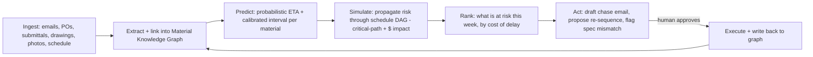

# Kayakalp — Predictive Material Control Tower for Construction

**Track:** Track 2 — Supply Chain

---

## The problem

On every construction project, once materials are ordered, chaos begins. The same
five questions get asked daily and nobody can answer them reliably:

> **What's been approved? What's being fabricated? What's delayed? Where is it now?
> Will it arrive when the project needs it?**

The data needed to answer them is real but scattered across POs (PDF), submittal logs,
supplier emails, WhatsApp photos from fab shops, delivery tickets, and the project
schedule (Primavera P6 / MS Project). Because no system fuses these, a slipping order is
discovered *after* the crew is already standing idle. Small material delays cascade along
the critical path into missed milestones and blown budgets. Construction is one of the
world's largest industries and among the least served by software — this gap is exactly why.

---

## The solution

Kayakalp is a **material control tower**: an AI system that ingests the scattered signals,
fuses them into a live **Material Knowledge Graph**, **predicts** each material's arrival as
a calibrated probability, **simulates** the schedule impact of any slip, and then **acts** to
prevent it. It answers the five questions on one screen and, critically, tells the team
*what to do right now* — ranked by cost of delay.

Three design choices make it adoptable where past tools failed:

- **Ingest by forwarding** an email inbox — no manual data entry.
- **Update by photo** — a foreman's phone picture updates status via a vision-language
  model, no forms.
- **Ask in plain language** — on web or WhatsApp, zero training.

---

## How it works (and why it's more than an API call)

1. **Ingest & extract.** Emails, POs, submittals, drawings, delivery tickets, and the
   schedule flow in. **Document intelligence** (ColPali visual retrieval + Docling
   extraction) turns messy PDFs and drawings into structured, linked facts.
2. **Understand the site.** **Qwen2.5-VL** reads job-site photos/video and delivery tickets,
   auto-updating fabrication and delivery status and flagging spec mismatches — no data entry.
3. **Predict.** A **probabilistic time-series + survival model** (Chronos / Lag-Llama)
   forecasts each material's arrival distribution; **conformal prediction** yields a
   calibrated interval.
4. **Simulate the cascade.** The ETA is propagated through the schedule modeled as a
   **critical-path DAG**, producing the true downstream impact and cost-of-delay.
5. **Act.** A **LangGraph agent** drafts the supplier escalation, proposes a schedule
   re-sequence, and flags spec issues — human approves with one click; the agent then
   executes and writes results back to the graph.

### The core loop

---

## AI techniques applied

Kayakalp combines the right techniques rather than wrapping a chatbot around a prompt.

**1. Vision-Language Models — understand, not just detect.**
We use **Qwen2.5-VL** to reason about job-site conditions, not draw boxes. A photo of the
fab shop returns: *"3 of 8 steel columns fabricated; 2 show incorrect weld prep vs. detail
S-204."* It reads delivery tickets and packing slips from a phone photo, watches a short site
video to confirm a crane is staged, and cross-checks installed work against the drawing.
Understanding site *state* → automatic status, zero forms.

**2. Document Intelligence — beyond OCR.**
Construction docs break OCR: multi-page submittals, dimensioned drawings, revision clouds,
approval stamps, spec sections. We apply **ColPali / ColQwen2 visual retrieval** — embedding
the *page image* — so "find the approved submittal and rebar grade for grid B-4" returns the
exact drawing region, spec clause, and stamp status. We extract structured fields (SKU, qty,
promised date, spec compliance) via **Docling / GOT-OCR2.0** as a typed fallback. This is a
technique competitors are unlikely to use.

**3. Forecasting & Optimization — probabilistic, calibrated, actionable.**
Per material we fit a **time-to-delivery hazard** and forecast with a **pretrained
probabilistic TS model (Chronos / Lag-Llama)** using supplier history, lead-time class, fab
progress, and logistics signals. **Conformal prediction** gives a trustworthy interval. Then
an **optimizer** acts on it: reorder priority, alternate-supplier swap, or a schedule
re-sequence that minimizes critical-path slip subject to crew/space constraints.

**4. Agentic Systems — it takes action.**
A **LangGraph tool-calling agent** retrieves docs (RAG), reads the graph, drafts and (on
approval) sends the supplier escalation, proposes the re-sequence to the scheduler, and can
place the call/message to the vendor. Question → prediction → *action*, with a human-approval
gate on anything external.

**5. Construction-Specific AI — it speaks your project.**
RAG grounded on **this project's** spec book, SKU catalog, submittal log, and approved vendor
list, plus a construction ontology (CSI MasterFormat divisions, submittal states, lead-time
classes). Optional **LoRA fine-tune** on construction language so "IFC," "long-lead," "RFI,"
"backcharge," and "float" mean the right thing. Answers are project-specific and spec-grounded,
never generic.

### The techniques nobody else will apply

- **ColPali / ColQwen2 visual-document retrieval over drawings** — RAG over the *pixels* of a
  drawing instead of the standard OCR → chunk → embed pipeline that destroys drawings, tables,
  stamps, and dimension callouts.
- **Conformal-calibrated probabilistic / survival ETAs** — trustworthy prediction intervals,
  not point guesses.
- **Delay-cascade propagation on the schedule DAG** — predict the *domino effect* through the
  critical path, priced in $.

---

## Open-source model stack

- **Qwen2.5-VL** — job-site photos, drawings, video, grounding / bounding boxes.
- **ColQwen2** — visual document retrieval.
- **Docling / GOT-OCR2.0** — structured extraction fallback.
- **Chronos-Bolt / Lag-Llama** — probabilistic ETA foundation models.
- **Llama-3.3-70B or Qwen2.5** — agent planner with tool-calling via **LangGraph**.

---

## Why now

Open-source VLMs (Qwen2.5-VL, InternVL), visual-document retrievers (ColQwen2), and
probabilistic TS foundation models (Chronos) crossed the accuracy/cost threshold in 2024–25
that finally makes passive, messy site data machine-readable and predictable — cheaply enough
to run per project. Data can stay on-prem with the general contractor.

---

## Impact

Fewer idle crews, earlier delay warnings, protected milestones, and lower cost — by turning
material chaos into a predictive, self-acting timeline.

> *Kayakalp — material chaos, rejuvenated into a predictive timeline.*
